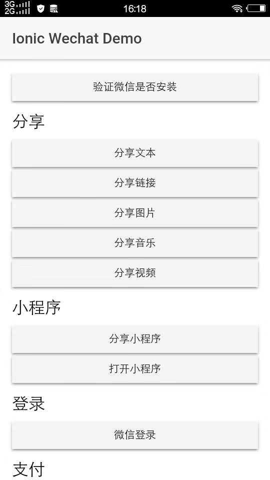

### About

this project is a ionic3 demo for [`cordova-plugin-wechat`]((https://github.com/xu-li/cordova-plugin-wechat))

[中文文档](README_CN.md)



### Usage

1. Download

```shell
git clone https://github.com/jasonz1987/ionic3-wechat-sdk-demo
```

2. Install dependency package

```shell
npm install
```

3. Modify package in  `config.xml`

4. Install the plugin and use the WeChat AppID  withe same bundle id.

```shell
ionic cordova plugin add cordova-plugin-wechat --variable wechatappid=wxxxxxxx
```

5. Add platform

```shell
ionic cordova platform add android
```

```shell
ionic cordova platform add ios
```

6. Run and debug

```shell
ionic cordova run android
```

```shell
ionic cordova run ios
```

### Course

This is a tutorial for ionic3 WeChat Development，i hope it can help you.

 https://www.jason-z.com/course/3

### Donate


If this project help you reduce time to develop, you can give me a cup of coffee :)

[](https://www.paypal.me/jasonz1987/6.66)

